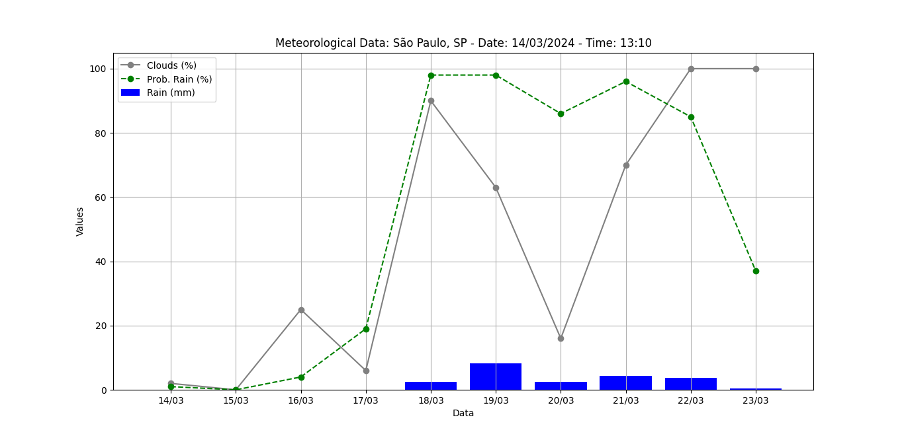

# Weather_forecast

### Documentation 

Description
This script performs weather forecasts based on user-supplied weather information for a city. 
Additionally, it also allows you to obtain city zip code information and display weather data in a bar graph. 
And uses Scikit-Learn, for machine learning based on meteorological data and data storing in csv file

## Dependencies

Make sure the following libraries are installed before running the script
`requests`
`Flask`
`pandas`
`scikit-learn`(contendo `MLPClassifier`)
`matplotlib`

### You can install them using the command:
```bash
pip install requests Flask pandas scikit-learn matplotlib
```
or 

```bash
pip install -r requirements.txt
```

## Functionalities

Function `new_weather_forecast(city)`
This function takes the name of a city as a parameter and performs the following actions:

- **Obtains city weather data using the HGBrasil API.**
- **Displays information about temperature, date, time, description, city and wind speed.**
- **Saves the data to a CSV file called `climate_weather.csv.`**
- **Reads the CSV file, selects relevant columns, and splits the data into training and testing sets.**
- **Train a Neural Network model using `MLPClassifier` of scikit-learn.**
- **Makes predictions on the test set and displays the predicted weather condition along with the probability of rain.**
- **Identifies days with a probability of rain above 50%.**
- **Creates a bar chart showing the amount of rain, percentage of clouds, and probability of rain for each day.**

## Function `get_information_cep(zip_code)`

This function receives a CEP as a parameter and performs the following actions:

- **Gets information about the CEP using the ViaCEP API.**

- **Displays the zip code, street, complement, neighborhood, city and UF**

### Comments

- **Make sure to replace 'YOUR KEY' in the HGBrasil API URL with your actual API key.**

- **The `get_information_cep(zip_code)` function is called automatically after obtaining the CEP information. 
If you don't want this functionality, comment out or remove the new_prevision(city) function call `new_weather_forecast(city)`**



[Silas Vasconcelos Cruz/Author] 
